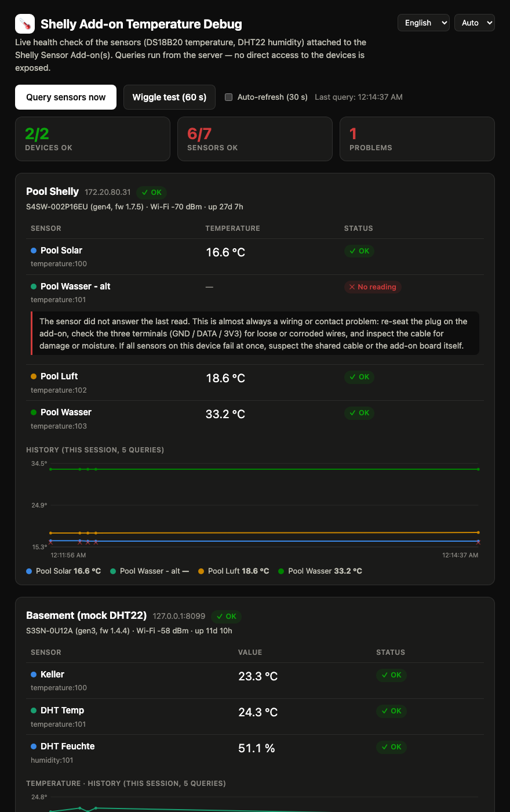

# 🌡 Shelly Add-on Temperature Debug

[](https://github.com/steiner-dominik/shelly-add-on-temperature-debug/actions/workflows/build.yml)
[](https://github.com/steiner-dominik/shelly-add-on-temperature-debug/releases)
[](LICENSE)
[](https://github.com/steiner-dominik/shelly-add-on-temperature-debug/pkgs/container/shelly-add-on-temperature-debug)

[](https://github.com/sponsors/steiner-dominik)
[](https://ko-fi.com/dominik_steiner)
[](https://buymeacoffee.com/dominik.st)

A tiny, **stateless** web app that gives anyone a safe, instant
troubleshooting view of the DS18B20 temperature sensors attached to one or
more [Shelly Add-ons](https://www.shelly.com/products/shelly-plus-add-on)
([docs](https://kb.shelly.cloud/knowledge-base/shelly-plus-add-on)) —
**without** handing out the Shelly admin password or exposing the device
itself to the internet.

> [!NOTE]
> **Community project.** Not affiliated with, endorsed, or supported by
> Shelly Group / Allterco Robotics. "Shelly" is a trademark of its
> respective owner and is used here only to describe compatibility.

<p align="center">
  
</p>

Typical use case: your dashboard lives at `mydashboard.example.com`, and you
want a helper to open `mydashboard.example.com/debug`, press one button, and
immediately see which sensor is healthy, which one reports the infamous
**85 °C power-on value**, and which one doesn't answer at all — with
plain-language guidance on what to check.

## Features

- 🔒 **Server-side querying** — the browser never talks to the Shelly and
  never sees the password (RFC 7616 digest auth, SHA-256)
- 🔑 **Mandatory access token** (`DEBUG_TOKEN`) — the API is never exposed
  unauthenticated; the token is entered once in the UI and remembered by
  the browser across reloads
- 📡 Works with Shelly **Gen2/Gen3/Gen4** devices (RPC API), multiple
  sensors per device, multiple devices — **DS18B20** temperature and
  **DHT22** humidity sensors
- 🩺 **Failure classification with guidance**: OK · 85 °C reset · no
  reading · missing · unreachable · auth failed · no sensors
- 📊 **Fleet summary bar** with per-device health chips and a **search
  filter** to zoom in on the one Shelly you are troubleshooting
- 🎯 **Per-sensor querying** — poll a single suspect sensor via its
  dedicated RPC without touching the rest
- 📈 **In-memory history graph** (one point per query) makes intermittent
  failures visible — clearable from the UI for a fresh test run, and
  **exportable as CSV** for plotting/analysis elsewhere
- ↗️ **Trend arrows** per sensor (vs. ~5 minutes ago) show at a glance
  what is heating up or cooling down
- 🔧 **Wiggle test**: polls every 2 s for 60 s while you physically re-seat
  cables and connectors — contact problems show up live in the graph
- 🧩 **Sensor provisioning** (optional, `PROVISION_PASSPHRASE`): let a
  helper plug in a **new DS18B20**, scan the 1-Wire bus from the page, name
  the probe, and attach it — without ever seeing the Shelly web UI or admin
  password. Gated by a separate passphrase on top of the access token;
  disabled unless configured
- 🔁 **Auto-refresh** toggle (interval and on-by-default configurable via
  env, pauses in background tabs)
- 🕙 **Background polling** (`BACKGROUND_POLL_SECONDS`): the server itself
  queries the Shellys on an interval, so history charts are already
  populated the moment someone opens the page
- 📱 **Installable as a PWA** — pinned toolbar and a layout tuned for
  phones make it a pocket sensor monitor
- 📊 Optional **Prometheus `/metrics`** endpoint for long-term monitoring
- 🌍 **Multi-language** (English, German — [add yours](docs/TRANSLATIONS.md)
  with a single JSON file)
- 🌗 **Dark / light / auto** theme, switchable on the page
- 🪶 **Stateless by design**: env-var config, history in RAM, nothing ever
  written to disk; ~9 MB `FROM scratch` image, zero third-party dependencies

## How it works

```
Browser ──HTTPS──▶ reverse proxy ──/debug──▶ this container ──HTTP digest auth──▶ Shelly device(s)
                                              (holds the Shelly
                                               password, in env only)
```

Statuses the page distinguishes, each with localized guidance:

| Status | Meaning |
|---|---|
| ✓ OK | Sensor reports a plausible value |
| ⚠ 85 °C reset | DS18B20 power-on default — sensor rebooted before measuring (wiring/power problem) |
| ✕ No reading | Sensor didn't answer the read (`null` / `read` error — wiring/contact problem) |
| ✕ Missing | Sensor is configured on the Shelly but absent from the live status |
| ✕ Unreachable / Auth failed | The Shelly itself couldn't be queried |
| ⚠ No sensors | Device answered but has no add-on temperature components |

See [docs/TROUBLESHOOTING.md](docs/TROUBLESHOOTING.md) for the full DS18B20
failure-mode guide.

## Quick start

```bash
docker run --rm -p 8080:8080 \
  -e DEBUG_TOKEN="$(openssl rand -hex 24)" \
  -e SHELLY_1_HOST=192.168.1.50 \
  -e SHELLY_1_NAME="Pool" \
  -e SHELLY_1_PASSWORD='your-shelly-admin-password' \
  ghcr.io/steiner-dominik/shelly-add-on-temperature-debug:latest
```

Open <http://localhost:8080/debug> and enter the token (echo it first if you
generated it inline). The browser remembers it across reloads.

### Home Assistant

The app is also available as a Home Assistant add-on from the
[steiner-dominik/home-assistant-apps](https://github.com/steiner-dominik/home-assistant-apps)
repository — one-click install, devices configured on the add-on's
configuration page, opened via ingress from the sidebar (no token or port
setup needed).

### docker-compose

A fully commented [docker-compose.example.yml](deploy/docker-compose.example.yml)
with **all** options and a matching [env.example](deploy/env.example) ship in
this repo (under `deploy/`) and are attached to every
[GitHub release](https://github.com/steiner-dominik/shelly-add-on-temperature-debug/releases):

```bash
curl -LO https://github.com/steiner-dominik/shelly-add-on-temperature-debug/releases/latest/download/docker-compose.example.yml
curl -LO https://github.com/steiner-dominik/shelly-add-on-temperature-debug/releases/latest/download/env.example
cp env.example .env                            # edit: hosts, passwords, token
mv docker-compose.example.yml docker-compose.yml
docker compose up -d
```

## Configuration (environment variables)

Endpoints are numbered `SHELLY_1_*`, `SHELLY_2_*`, … — numbering must be
contiguous and start at 1.

| Variable | Required | Default | Description |
|---|---|---|---|
| `SHELLY_n_HOST` | yes (n=1..) | – | IP or FQDN of the Shelly, optionally with scheme (`http://` assumed) |
| `SHELLY_n_NAME` | no | host | Display name on the page |
| `SHELLY_n_PASSWORD` | no | `SHELLY_PASSWORD` | Device admin password (omit if auth is disabled) |
| `SHELLY_n_USER` | no | `admin` | Auth user (Gen2+ is always `admin`) |
| `SHELLY_PASSWORD` | no | – | Fallback password for all endpoints |
| `DEBUG_TOKEN` | **yes** | – | Access token the API requires on every request (`X-Debug-Token` or `Authorization: Bearer` header). Entered once in the UI, stored by the browser. Never accepted as a URL parameter. Setting it **explicitly empty** (`DEBUG_TOKEN=`) disables authentication — only do that behind an authenticating reverse proxy |
| `PROVISION_PASSPHRASE` | no | – | Enables **sensor provisioning**: with this set, the page offers scanning the Sensor Add-on's 1-Wire bus and attaching new DS18B20 probes (name asked before adding; the Shelly reboots to activate the sensor). Requests must carry the passphrase as an `X-Provision-Key` header **in addition** to the token. Unset = the provisioning API does not exist |
| `BASE_PATH` | no | `/debug` | Path prefix the app serves under (use `/` for root) |
| `PORT` | no | `8080` | Listen port |
| `HISTORY_MAX_MB` | no | `16` | Total in-memory history budget in MB, shared by **all** sensors (~64 bytes per sample → 16 MB ≈ 260k samples). When full, the oldest samples across all sensors are dropped. Charts show the newest 1000 per sensor; the CSV export contains everything. Replaces the former per-sensor `HISTORY_SIZE`, which is ignored (with a startup warning) |
| `BACKGROUND_POLL_SECONDS` | no | `0` | `> 0`: the server polls all Shellys itself on this interval (through the same rate-limited cache as the UI), so history exists before the first page view. `0` disables it — queries then only happen while somebody uses the page |
| `QUERY_TIMEOUT_SECONDS` | no | `5` | Per-device query timeout |
| `QUERY_MIN_INTERVAL_SECONDS` | no | `2` | Rate limit: minimum time between real device queries; faster requests get a shared cached result |
| `AUTO_REFRESH_SECONDS` | no | `30` | Interval of the page's auto-refresh |
| `AUTO_REFRESH_DEFAULT` | no | `false` | Set to `true` to start auto-refresh enabled for browsers that never touched the toggle |
| `METRICS_ENABLED` | no | `false` | Set to `true` to expose Prometheus metrics at `{BASE_PATH}/metrics` |

## Reverse proxy

The app already serves everything under `BASE_PATH` (default `/debug`), so a
path-preserving proxy rule is all you need.

**Caddy**

```
mydashboard.example.com {
    reverse_proxy /debug* shelly-debug:8080
}
```

**nginx**

```nginx
location /debug {
    proxy_pass http://shelly-debug:8080;
}
```

**Traefik (labels)**

```yaml
- traefik.http.routers.shelly-debug.rule=Host(`mydashboard.example.com`) && PathPrefix(`/debug`)
- traefik.http.services.shelly-debug.loadbalancer.server.port=8080
```

## Versioning & releases

Releases use **CalVer**: `YYYY.MM.DD` (UTC), with `.1`, `.2`, … appended for
further releases on the same day. Every push to `main` automatically:

1. runs tests,
2. builds and pushes the multi-arch image to GHCR, tagged
   `latest`, `main`, `sha-<commit>`, and the CalVer version,
3. creates a git tag + [GitHub release](https://github.com/steiner-dominik/shelly-add-on-temperature-debug/releases)
   with generated notes and standalone Linux binaries (amd64/arm64) attached.

Pin the CalVer tag (e.g. `:2026.07.17`) in production if you don't want
`latest` to move under you. The running version is shown in the page footer.

## Languages

The page ships in **English** and **German** and picks the browser's language
automatically (switchable on the page). Adding a language is a single JSON
file — see [docs/TRANSLATIONS.md](docs/TRANSLATIONS.md). Contributions
welcome!

## Security

Designed to be internet-facing behind a TLS reverse proxy: the Shelly
password never leaves the server, device queries are read-only and
rate-limited (no amplification against your devices; the only write
capability — attaching new sensors — requires the separate
`PROVISION_PASSPHRASE` and does not exist otherwise), the API always
requires the `DEBUG_TOKEN` (headers only — never in URLs), and the page
sets a strict Content-Security-Policy (no inline scripts/styles) and loads
zero external resources. Details, threat model, and hosting
recommendations: [SECURITY.md](SECURITY.md).

## Software bill of materials & updating

The whole point of this project is a minimal supply chain — there is **no
third-party runtime code at all**:

| Component | Where | What it is | How to update |
|---|---|---|---|
| Go standard library | `go.mod` (no external modules) | The only code dependency | Bump the `go` directive in `go.mod` |
| `golang:1.26-alpine` | `Dockerfile` (build stage only) | Compiler image; also the source of the CA bundle | Bump the tag (Dependabot PRs this) |
| `scratch` | `Dockerfile` (runtime) | Empty base image — nothing to patch | – |
| `actions/checkout`, `actions/setup-go`, `docker/*` actions | `.github/workflows/build.yml` | CI plumbing, not shipped in the image | Bump versions (Dependabot PRs this) |
| Frontend | `web/static/` (`index.html`, `app.css`, `app.js`, `sw.js`, `manifest.webmanifest`, icons) | Hand-written vanilla JS/CSS, no frameworks, no CDN loads | Edit the files |

[Dependabot is configured](.github/dependabot.yml) to open weekly PRs for the
Go toolchain, the Docker base image, and the GitHub Actions. **If this repo
ever goes unmaintained**, updating it yourself is: bump the two version
strings (`go.mod`, `Dockerfile`), push to a fork with Actions enabled, and CI
tests + builds + releases everything. `go build` on any machine with Go
installed produces the identical single binary.

## API

| Endpoint | Method | Description |
|---|---|---|
| `{BASE_PATH}/` | GET | The debug page |
| `{BASE_PATH}/api/query` | POST/GET | Query all Shellys live (rate-limited, cached), append to history, return results incl. status codes |
| `{BASE_PATH}/api/query/sensor?ep={idx}&key={key}` | POST/GET | Query one single sensor (its `Temperature`/`Humidity.GetStatus` RPC); `ep` is the 0-based endpoint index, `key` e.g. `temperature:100` |
| `{BASE_PATH}/api/history` | GET | The in-memory history buffer; `?limit=N` returns only the newest N samples per sensor (the page charts use `limit=1000`) |
| `{BASE_PATH}/manifest.webmanifest`, `{BASE_PATH}/sw.js` | GET | PWA manifest and service worker (app shell only; API responses are never cached) |
| `{BASE_PATH}/api/history` | DELETE | Clear the in-memory history |
| `{BASE_PATH}/api/provision/scan?ep={idx}` | POST/GET | Scan the endpoint's 1-Wire bus (`SensorAddon.OneWireScan`); returns probes with their linked component (or none) — only with `PROVISION_PASSPHRASE` set, requires the `X-Provision-Key` header |
| `{BASE_PATH}/api/provision/add` | POST | Attach one scanned probe: body `{"ep":0,"addr":"…","name":"…"}`; adds the peripheral, reboots the Shelly, then names the new component in the background — same gating as scan |
| `{BASE_PATH}/api/provision/status?ep={idx}` | GET | Progress of provisioning jobs (`rebooting` → `naming` → `done`/`error`) — same gating as scan |
| `{BASE_PATH}/locales/index.json` | GET | Available languages |
| `{BASE_PATH}/locales/{code}.json` | GET | Locale strings (labels + guidance) |
| `{BASE_PATH}/metrics` | GET | Prometheus metrics (only when `METRICS_ENABLED=true`) |
| `/healthz` | GET | Liveness probe (no auth) |

Every `/api/*` and `/metrics` request must present the token, either as
`X-Debug-Token: <token>` or `Authorization: Bearer <token>`. Tokens in URL
query parameters are **not** accepted (they would leak into proxy/access
logs and browser history). With an explicitly empty `DEBUG_TOKEN` the API
is open (see the configuration table).

### Prometheus

With `METRICS_ENABLED=true`, each scrape returns the (rate-limited, cached)
live readings as gauges:

- `shelly_debug_temperature_celsius{endpoint,sensor,key}` /
  `shelly_debug_humidity_percent{…}` — absent while a sensor gives no value
- `shelly_debug_sensor_ok{endpoint,sensor,key,kind}` and a state-set
  `shelly_debug_sensor_status{endpoint,key,status}` — alert on `sensor_ok == 0`
- `shelly_debug_endpoint_up`, `shelly_debug_endpoint_wifi_rssi_dbm`,
  `shelly_debug_endpoint_uptime_seconds`, `shelly_debug_last_query_timestamp_seconds`

```yaml
scrape_configs:
  - job_name: shelly-debug
    metrics_path: /debug/metrics
    scrape_interval: 60s
    static_configs: [{ targets: ["shelly-debug:8080"] }]
    authorization:            # DEBUG_TOKEN as standard bearer token
      credentials: <your token>
```

Machine-readable status codes (`ok`, `reset85`, `read_error`, `missing`,
`unreachable`, `auth_failed`, `no_sensors`) are returned in the JSON API and
as metric labels; human-readable texts live in the locale files.

## Development

```bash
export DEBUG_TOKEN=dev SHELLY_1_HOST=192.168.1.50 SHELLY_1_PASSWORD='…'
go run .
# → http://localhost:8080/debug
go test ./...
```

## ❤️ Support

If this project is useful to you, you can support its development:

- [GitHub Sponsors](https://github.com/sponsors/steiner-dominik)
- [Ko-fi](https://ko-fi.com/dominik_steiner)
- [Buy Me a Coffee](https://buymeacoffee.com/dominik.st)

## License

[MIT](LICENSE)
